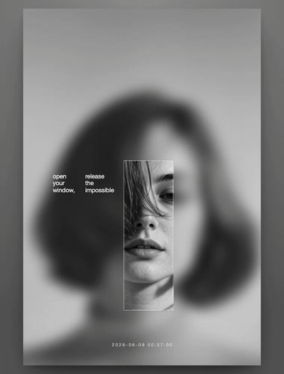

# ji-blur-site



An interactive, monochrome poster recreation — *"open your window, release the impossible"* — built from a single still poster.

**Build time: ~19 minutes** end-to-end, from the input photo to the working site (`portrait.jpg` 22:30 → site live 22:49, the whole asset pipeline below).

Open `index.html` (any static server). Move the cursor: a sharp focus window follows it across an otherwise-blurred, quietly-breathing portrait. The timestamp ticks live.

## How it works

- **Two stacked video layers** of the same looping clip. The back layer is heavily blurred (the ambient); the front layer is sharp and revealed only through a `clip-path: inset()` rectangle, so the in-focus slice stays pixel-aligned at any size.
- **Cursor-tracked focus** — the sharp window re-centres on the pointer (clamped to the frame, eased trail) and rests on the face when the cursor leaves.
- **Live timestamp**, film grain (SVG `feTurbulence`), tone wash + vignette.
- **Type** — Helvetica Neue (the source poster's neo-grotesque), Inter fallback.

## Assets (`assets/`)

| File | What | How it was made |
|------|------|-----------------|
| `portrait.jpg` | original poster (cropped frame) | source |
| `poster_upscaled.png` | poster at 4× (1896×2368) | fal `aura-sr` v2 |
| `portrait_clean.png` | sharp, de-blurred, de-texted portrait | fal `gpt-image-1.5/edit` |
| `motion_raw.mp4` | 5s subtle-motion clip (breathing, hair sway, blink) | fal `wan/v2.6/i2v/flash` |
| `motion_loop.mp4` | seamless 10s loop | ffmpeg boomerang (forward + reverse) |

## Run locally

```bash
python3 -m http.server 8000
# → http://localhost:8000
```
